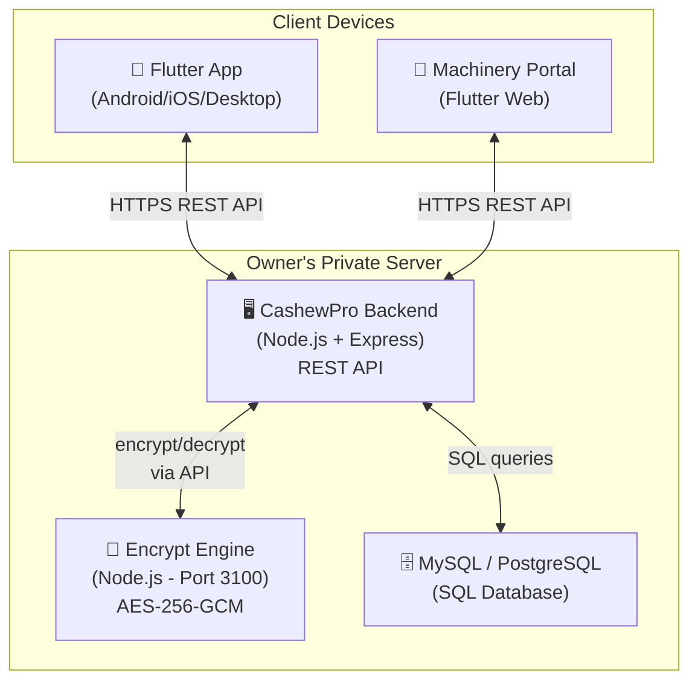
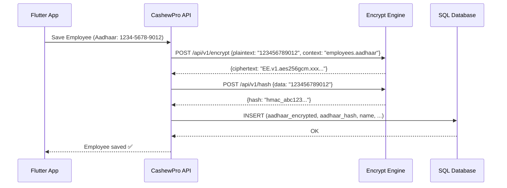
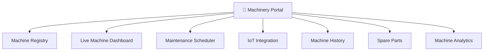
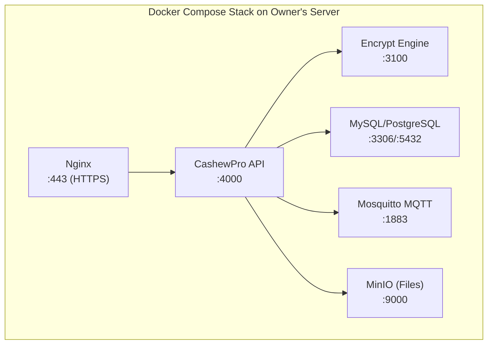

# 🏭 CashewPro ERP — Updated Implementation Plan v2.0

> **Full Flutter App + Self-Hosted SQL + Encrypt Engine Security + Machinery Portal**

---

## 1. Architecture Overview



### Key Architecture Decisions

| Decision | Choice | Reason |
|---|---|---|
| **Frontend** | Flutter (single codebase) | Android, iOS, Web, Desktop from one codebase |
| **Backend** | Node.js + Express REST API | Pairs with your Encrypt Engine (also Node.js) |
| **Database** | MySQL or PostgreSQL (SQL) | Self-hosted on owner's private server |
| **Security** | Your Encrypt Engine | AES-256-GCM, Envelope Encryption, Tokenization |
| **Deployment** | Docker Compose on private server | API + Encrypt Engine + DB in one stack |

---

## 2. Encrypt Engine Integration

Your Encrypt Engine (`E:\encrypt engine`) provides:

| Capability | API Endpoint | Use in CFMS |
|---|---|---|
| **Encrypt** | `POST /api/v1/encrypt` | Employee Aadhaar, bank details, salary data |
| **Decrypt** | `POST /api/v1/decrypt` | Viewing sensitive data (authorized users only) |
| **Batch Encrypt** | `POST /api/v1/encrypt/batch` | Bulk import of employee/supplier records |
| **Batch Decrypt** | `POST /api/v1/decrypt/batch` | Report generation with sensitive fields |
| **Hash (HMAC)** | `POST /api/v1/hash` | Searchable encrypted fields (lookup by Aadhaar) |
| **Tokenize** | `POST /api/v1/tokenize` | Replace sensitive data with tokens in logs |
| **Detokenize** | `POST /api/v1/detokenize` | Retrieve originals when authorized |

### What Gets Encrypted

| Data Category | Fields Encrypted | Context (AAD) |
|---|---|---|
| **Employee PII** | Aadhaar number, PAN, bank account, IFSC | `employees.aadhaar`, `employees.bank` |
| **Supplier Finance** | Bank details, payment terms | `suppliers.bank` |
| **Customer Finance** | Bank details, credit card info | `customers.bank` |
| **Payroll** | Net salary, deductions, advances | `payroll.salary` |
| **Accounting** | Transaction amounts (optional) | `ledger.amount` |
| **API Keys/Passwords** | User credentials, integration keys | `auth.credentials` |

### Security Flow



---

## 3. Complete Module Map (15 Modules)

```mermaid
graph TD
    A["🏠 Dashboard"] --> B["📦 Procurement"]
    A --> C["🏗️ Inventory & Stock"]
    A --> D["⚙️ Live Processing"]
    A --> E["🔬 Grading & QC"]
    A --> F["👷 Employee & Payroll"]
    A --> G["💰 Accounting & Finance"]
    A --> H["🛒 Sales & Dispatch"]
    A --> I["♻️ Byproduct & Waste"]
    A --> J["📋 Compliance & Docs"]
    A --> K["🔧 Machinery Portal ✨ NEW"]
    A --> L["📊 Reports & Analytics"]
    A --> M["⚙️ Settings & Admin"]
    A --> N["🔐 Security (Encrypt Engine)"]
    A --> O["📱 Multi-Platform App"]
```



---

## 4. Module Details

### 4.1 🏠 Dashboard
- Real-time factory overview (WebSocket updates)
- Today's production, inventory snapshot, revenue cards
- Employee attendance, active alerts, yield tracker
- Processing pipeline kanban view
- Role-based widgets (Owner vs Supervisor vs Accountant)

### 4.2 📦 Procurement & Purchase
- Supplier directory with rating & history
- Purchase orders with quantity, price/kg, moisture %
- Goods receipt with gate quality check
- Price negotiation log & advance payments
- Transport tracking (vehicle, driver, freight)
- Auto inventory update on receipt confirmation

### 4.3 🏗️ Inventory & Stock Management
- **Categories:** Raw (RCN), Work-in-Progress, Finished (by grade), Byproducts, Packaging, Consumables
- Multi-warehouse support, lot/batch traceability
- Min-stock alerts, FIFO/weighted average valuation
- Physical audit with variance calculation
- Barcode/QR scanning, stock transfers with approval
- Expiry tracking for perishables

### 4.4 ⚙️ Live Daily Processing
- **12 Stages:** Cleaning → Calibration → Steam/Roast → Cooling → Shelling → Borma Drying → Humidification → Peeling → Grading → QC → Packing → Storage
- Per-stage: input/output kg, wastage, time, operator, machine, temperature, moisture
- Kanban board view, shift management, yield calculator
- Supervisor approval workflow, photo capture for QC

### 4.5 🔬 Grading & Quality Control
- Grades: W180, W210, W240, W320, W450, SW, SSW, Splits, Butts, Pieces
- QC parameters: moisture, color, broken ratio, aflatoxin, metal detection
- Auto-grade suggestion, digital QC checklist
- Grade-wise stock summary, quality certificates (PDF)
- Grade price master with market rates

### 4.6 👷 Employee & HR Management
- Employee types: Shellers (piece-rate), Peelers (piece-rate), Graders (daily), Operators (salary), Supervisors, Drivers, Admin
- Attendance (biometric/manual/GPS), piece-rate calculator
- Salary/daily-wage/overtime tracking, advance/loan management
- PF/ESI compliance, payslip PDF generation
- Performance tracking (kg/worker/day), contractor management
- **🔐 Aadhaar, PAN, bank details encrypted via Encrypt Engine**

### 4.7 💰 Accounting & Finance
- Purchase/Sales accounting with auto-entries from other modules
- Supplier/Customer ledgers with aging reports
- Expense management with categories & receipt upload
- Cash/bank book, bank reconciliation, UPI tracking
- **GST:** HSN mapping (08013100/08013200), 5% auto-calc, GSTR data export
- P&L (lot-wise, grade-wise), balance sheet, trial balance
- Tally export format

### 4.8 🛒 Sales, Orders & Dispatch
- Customer directory, grade-wise pricing per customer
- Sales orders, packing slips, GST invoices
- Dispatch management, delivery confirmation with e-signature
- Payment collection & receivable tracking
- Export docs: commercial invoice, COO, phytosanitary cert, bill of lading
- Multi-currency support (USD, EUR)

### 4.9 ♻️ Byproduct & Waste Management
- Track: Shells, CNSL oil, Testa, Reject kernels
- Shell accumulation (kg/day), CNSL extraction logs
- Byproduct sales records, waste disposal logs
- Revenue from byproducts dashboard

### 4.10 📋 Compliance & Document Management
- Track: FSSAI, Factory License, GST, IEC, APEDA, RCMC, Fire Safety, Pollution NOC, HACCP/ISO, PF/ESI
- Document upload & digital storage
- Expiry calendar with 30/15/7 day advance alerts
- Auto-reminders (push, SMS, email)

### 4.11 🔧 Machinery Portal ✨ NEW

**Purpose:** Dedicated portal for managing all factory machinery with IoT integration capabilities.

#### Portal Structure



#### Machine Registry
- **Add machines:** Name, model, manufacturer, serial no., purchase date, cost, warranty
- **Machine types:** Steam boiler, Shelling machine, Borma dryer, Peeling machine, Grading table, Color sorter, Vacuum packer, Weighing scale, CNSL expeller, Generator
- **QR code generation** per machine for quick identification
- **Documents:** Manuals, warranty cards, AMC contracts (uploaded)

#### Live Machine Dashboard
- **Real-time status:** Running / Idle / Under Maintenance / Breakdown
- **IoT metrics** (for supported machines):
  - Temperature, pressure, RPM, power consumption
  - Hours run today / total lifetime hours
  - Vibration levels, oil pressure
- **Production counters:** Kg processed today by this machine
- **Operator assignment:** Who is currently operating
- **Visual floor map:** Drag-drop machine placement on factory layout

#### IoT Integration Protocol

| Machine Type | Supports IoT? | Data Collected |
|---|---|---|
| Steam Boiler | ✅ Yes | Temperature, pressure, fuel consumption |
| Shelling Machine | ✅ Yes | RPM, count per hour, jam alerts |
| Borma Dryer | ✅ Yes | Temperature zones, humidity, timer |
| Color Sorter | ✅ Yes | Sort count, reject rate, camera status |
| Vacuum Packer | ✅ Yes | Seal count, vacuum pressure, bag count |
| Weighing Scale | ✅ Yes | Weight readings, calibration status |
| Manual Grading Table | ❌ No | Manual input only |
| Generator | ✅ Yes | Fuel level, load %, runtime hours |

**Integration Methods:**
1. **MQTT Protocol** — For IoT-enabled machines with sensors
2. **Modbus TCP** — For industrial PLCs and controllers
3. **Manual Entry** — Operator inputs data via tablet/phone
4. **API Webhooks** — For machines with built-in APIs

#### Machine-Specific Work Display

Each machine gets its own portal page showing:
- **Today's work:** Total kg input → output → wastage
- **Lot tracking:** Which lots were processed, when
- **Operator log:** Who operated, shift times
- **Performance score:** Efficiency % (actual vs rated capacity)
- **Downtime log:** Stop reasons, duration
- **Quality impact:** Grade distribution of output

#### Maintenance Scheduler
- Preventive maintenance auto-schedule based on:
  - Running hours (e.g., service every 500 hrs)
  - Calendar (e.g., monthly oil change)
  - Condition (when sensor readings exceed threshold)
- Breakdown reporting with photo/video upload
- Repair cost tracking per incident
- Vendor/technician assignment & tracking
- **Spare Parts Inventory:** Track parts stock, reorder alerts, link parts to machines

#### Machine Analytics
- Uptime % per machine (daily/weekly/monthly)
- Cost-per-kg processed per machine
- Energy consumption trends
- Maintenance cost history
- Machine ROI calculator
- Predictive maintenance alerts (when sensor trends indicate wear)

---

### 4.12 📊 Reports & Analytics
- **Production:** Daily summary, stage-wise output, yield/outturn, shift comparison
- **Inventory:** Stock position, movement, aging, wastage
- **Financial:** P&L, cash flow, expense analysis, outstanding reports
- **Employee:** Attendance, piece-rate earnings, productivity ranking
- **Quality:** Grade distribution, QC pass/fail, moisture trends
- **Sales:** By grade/customer/period, fulfillment rate
- **Machinery:** Uptime, efficiency, maintenance cost, energy consumption
- **Advanced:** Season comparison, supplier scoring, break-even calculator

### 4.13 ⚙️ Settings & Administration
- Company profile (name, logo, GSTIN, FSSAI)
- User management with RBAC (Owner, Manager, Supervisor, Accountant, Operator, Worker)
- Grade/stage/tax configuration masters
- Notification preferences, backup & export
- Multi-factory support, audit log, white-label branding

### 4.14 🔐 Security Module (Encrypt Engine)
- Encrypt Engine health monitoring dashboard
- API key management for CFMS ↔ Encrypt Engine
- Encryption audit logs (who accessed what sensitive data)
- Key rotation scheduling
- Data breach detection alerts
- Encrypted backup verification

### 4.15 📱 Multi-Platform Flutter App
- Android (primary), iOS, Web (for Machinery Portal)
- Offline mode with SQLite + sync when online
- Push notifications, barcode/QR scanner
- GPS attendance, photo capture for QC
- Responsive layouts for phone, tablet, desktop

---

## 5. Tech Stack (Updated)

| Layer | Technology |
|---|---|
| **App (All Platforms)** | Flutter 3.x + Dart |
| **State Management** | Riverpod 2.0 |
| **Local DB (Offline)** | SQLite (sqflite / drift) |
| **Backend API** | Node.js + Express + TypeScript |
| **Server Database** | MySQL 8.0 or PostgreSQL 16 |
| **ORM** | Prisma (type-safe SQL) |
| **Security/Encryption** | Encrypt Engine (your project — AES-256-GCM) |
| **Real-time** | Socket.io (dashboard + machinery portal) |
| **IoT Protocol** | MQTT broker (Mosquitto) for machine sensors |
| **File Storage** | Local server filesystem + S3-compatible (MinIO) |
| **PDF Generation** | Server-side: Puppeteer / Client-side: pdf package |
| **Charts** | fl_chart (Flutter) |
| **Auth** | JWT (issued by backend, encrypted via Encrypt Engine) |
| **Notifications** | Firebase Cloud Messaging + Twilio SMS |
| **Deployment** | Docker Compose (API + Encrypt Engine + DB + MQTT) |
| **Reverse Proxy** | Nginx (SSL termination, load balancing) |

---

## 6. Server Deployment Architecture



### docker-compose.yml Structure
```yaml
services:
  nginx:        # Reverse proxy + SSL
  cashewpro-api: # Main backend API
  encrypt-engine: # Your Encrypt Engine
  database:     # MySQL or PostgreSQL
  mqtt-broker:  # Mosquitto for IoT machines
  minio:        # File/document storage
  redis:        # Caching (optional)
```

---

## 7. Database Schema (Key Tables — SQL)

```sql
-- Core
users, factories, roles, permissions

-- Procurement
suppliers, purchases, purchase_items, goods_receipts

-- Inventory
inventory_items, stock_movements, warehouses, stock_audits

-- Processing
processing_lots, processing_stages, stage_logs

-- Grading
grades, grading_results, qc_checklists, qc_parameters

-- Employees (PII encrypted via Encrypt Engine)
employees, attendance, piece_work, payroll, advances, leaves

-- Accounting
ledger_entries, expenses, expense_categories, bank_accounts,
cash_books, gst_invoices, payment_records

-- Sales
customers, sales_orders, order_items, invoices, dispatches,
delivery_proofs, export_documents

-- Byproducts
byproducts, byproduct_sales, waste_logs

-- Compliance
documents, document_types, compliance_alerts

-- Machinery (NEW)
machines, machine_types, machine_sensors, sensor_readings,
maintenance_schedules, maintenance_logs, breakdowns,
spare_parts, spare_part_usage, machine_work_logs,
machine_operators, machine_documents

-- Security
encrypt_audit_logs, api_keys, login_sessions

-- System
notifications, audit_log, settings, backups
```

---

## 8. Flutter App Structure

```
lib/
├── main.dart
├── app.dart
├── config/
│   ├── routes.dart
│   ├── themes.dart
│   └── constants.dart
├── core/
│   ├── api/              # HTTP client, interceptors
│   ├── auth/             # JWT auth, session
│   ├── database/         # Local SQLite for offline
│   ├── encryption/       # Encrypt Engine client
│   └── sync/             # Offline sync engine
├── features/
│   ├── dashboard/
│   ├── procurement/
│   ├── inventory/
│   ├── processing/
│   ├── grading/
│   ├── employees/
│   ├── accounting/
│   ├── sales/
│   ├── byproducts/
│   ├── compliance/
│   ├── machinery/        # ✨ Machinery Portal
│   ├── reports/
│   ├── security/
│   └── settings/
├── shared/
│   ├── widgets/
│   ├── models/
│   └── utils/
└── l10n/                 # Localization (EN, HI, GU)
```

---

## 9. UI/UX Design

- **Dark theme** primary with amber/gold cashew branding accents
- **Glassmorphism** cards on dashboard
- **Material 3** design system in Flutter
- **Large touch targets** for factory floor tablets
- **Color-coded stages:** Green (done), Blue (active), Gray (pending), Red (issue)
- **Hindi/Gujarati** toggle for workers
- **Offline-first** with sync indicators
- **Animated transitions** between screens

---

## 10. Phased Delivery Plan

### Phase 1 — Foundation (Weeks 1-3)
- [ ] Flutter project setup with folder structure
- [ ] Backend API setup (Express + TypeScript + Prisma)
- [ ] Docker Compose with Encrypt Engine + DB
- [ ] Auth system (JWT + Encrypt Engine for credentials)
- [ ] Database schema & migrations (all tables)
- [ ] Design system (theme, shared widgets)
- [ ] Settings & user management with RBAC

### Phase 2 — Core Operations (Weeks 4-7)
- [ ] Procurement module (suppliers, POs, receipts)
- [ ] Inventory management (all categories, alerts)
- [ ] Live processing module (12 stages, kanban)
- [ ] Grading & QC module
- [ ] Offline SQLite + sync engine

### Phase 3 — People & Money (Weeks 8-10)
- [ ] Employee management (encrypted PII)
- [ ] Attendance + piece-rate + payroll
- [ ] Accounting (ledgers, expenses, cash/bank)
- [ ] GST invoicing & compliance

### Phase 4 — Sales & Output (Weeks 11-13)
- [ ] Sales orders & dispatch
- [ ] Invoice & billing (GST)
- [ ] Export documentation
- [ ] Byproduct & waste management

### Phase 5 — Machinery Portal (Weeks 14-16) ✨
- [ ] Machine registry & QR codes
- [ ] Live machine dashboard with status
- [ ] IoT integration (MQTT + Modbus)
- [ ] Machine-specific work display pages
- [ ] Maintenance scheduler & spare parts
- [ ] Machine analytics & efficiency reports
- [ ] Flutter Web build for portal access

### Phase 6 — Intelligence & Polish (Weeks 17-19)
- [ ] Main dashboard with real-time widgets
- [ ] All reports & analytics
- [ ] Compliance & document management
- [ ] Security monitoring dashboard
- [ ] Notifications (push, SMS)
- [ ] Multi-language (EN, HI, GU)
- [ ] Performance optimization & testing

---

## 11. Pricing Model (Self-Hosted License)

| Plan | One-Time License | Annual Support | Includes |
|---|---|---|---|
| **Standard** | ₹49,999 | ₹9,999/yr | Single factory, 10 users, core modules |
| **Professional** | ₹99,999 | ₹19,999/yr | Single factory, unlimited users, all modules + Machinery Portal |
| **Enterprise** | ₹1,99,999 | ₹39,999/yr | Multi-factory, unlimited, IoT, white-label, priority support |

> Since it's self-hosted (not SaaS), use **one-time license + annual support** model.

---

## 12. Key Selling Points

1. **100% Self-Hosted** — Owner's data stays on owner's server
2. **Military-Grade Encryption** — AES-256-GCM via Encrypt Engine
3. **Built for Cashew** — Not generic ERP; knows W180-W450 grades
4. **Machinery IoT Portal** — Real-time machine monitoring
5. **Piece-Rate Payroll** — Unique to cashew industry
6. **Full Lot Traceability** — Farm to buyer
7. **Offline-First Flutter** — Works without internet
8. **Regional Languages** — Hindi, Gujarati
9. **One-Click Docker Deploy** — Easy server setup
10. **Export-Ready Docs** — COO, phyto cert, bill of lading

---

> **Next Step:** Approve this plan → I start building Phase 1 immediately.
